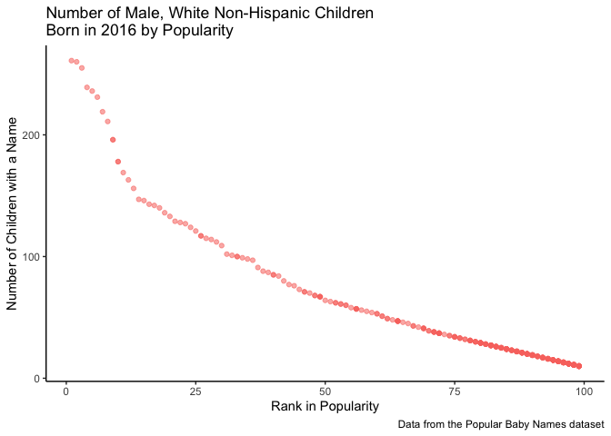

Homework\_2\_practice
================
Kodiak Soled
9/28/2019

# *Problem \#1*

## *Mr. Trash Wheel*

### First, we will need to load the tidyverse package for some of the datacleaning we will perform:

``` r
library(tidyverse)
```

### Then, we can load the `readxl` package in order to import the Excel file data using `read_excel`, specify the sheet in the Excel file we want with `sheets`, and omit non-data entries by specifying the columns and rows we want to include with the `range` function. We can also clean up the names of the variables with the `janitor::clean_names()` function. Next, we can omit the rows that do not include dumpster-specific data by using `drop_na`. Lastly, we can round the number of sports balls to the nearest integer and convert the result to an integer variable using `as.integer`.

``` r
library(readxl)
mr_trash_wheel = read_excel("./data/TrashWheelCollectionTotals.xlsx", sheet = "Mr. Trash Wheel", range = "A2:N406") %>%
  janitor::clean_names() %>%
  drop_na(dumpster) %>%
  mutate(sports_balls = as.integer(sports_balls, 0))
    
mr_trash_wheel
```

    ## # A tibble: 344 x 14
    ##    dumpster month  year date                weight_tons volume_cubic_ya…
    ##       <dbl> <chr> <dbl> <dttm>                    <dbl>            <dbl>
    ##  1        1 May    2014 2014-05-16 00:00:00        4.31               18
    ##  2        2 May    2014 2014-05-16 00:00:00        2.74               13
    ##  3        3 May    2014 2014-05-16 00:00:00        3.45               15
    ##  4        4 May    2014 2014-05-17 00:00:00        3.1                15
    ##  5        5 May    2014 2014-05-17 00:00:00        4.06               18
    ##  6        6 May    2014 2014-05-20 00:00:00        2.71               13
    ##  7        7 May    2014 2014-05-21 00:00:00        1.91                8
    ##  8        8 May    2014 2014-05-28 00:00:00        3.7                16
    ##  9        9 June   2014 2014-06-05 00:00:00        2.52               14
    ## 10       10 June   2014 2014-06-11 00:00:00        3.76               18
    ## # … with 334 more rows, and 8 more variables: plastic_bottles <dbl>,
    ## #   polystyrene <dbl>, cigarette_butts <dbl>, glass_bottles <dbl>,
    ## #   grocery_bags <dbl>, chip_bags <dbl>, sports_balls <int>,
    ## #   homes_powered <dbl>

## *Precipitation Data*

### First, we can read (`read_excel`) and clean (`janitor::clean_names()`) the preciptation data for years 2017 and 2018. Again, we can omit the rows without the precipitation data by specifying the `range` of rows and columns to include. Lastly, we can add a variable year to each data set with the `mutate` function.

``` r
precip_data_2018 = 
  read_excel("./data/TrashWheelCollectionTotals.xlsx", sheet = "2018 Precipitation", range = "A2:B14") %>%
  janitor::clean_names() %>%
  mutate(year = 2018)

precip_data_2018
```

    ## # A tibble: 12 x 3
    ##    month total  year
    ##    <dbl> <dbl> <dbl>
    ##  1     1  0.94  2018
    ##  2     2  4.8   2018
    ##  3     3  2.69  2018
    ##  4     4  4.69  2018
    ##  5     5  9.27  2018
    ##  6     6  4.77  2018
    ##  7     7 10.2   2018
    ##  8     8  6.45  2018
    ##  9     9 10.5   2018
    ## 10    10  2.12  2018
    ## 11    11  7.82  2018
    ## 12    12  6.11  2018

``` r
precip_data_2017 = 
  read_excel("./data/TrashWheelCollectionTotals.xlsx", sheet = "2017 Precipitation", range = "A2:B14") %>%
  janitor::clean_names() %>%
  mutate(year = 2017)
 
precip_data_2017
```

    ## # A tibble: 12 x 3
    ##    month total  year
    ##    <dbl> <dbl> <dbl>
    ##  1     1  2.34  2017
    ##  2     2  1.46  2017
    ##  3     3  3.57  2017
    ##  4     4  3.99  2017
    ##  5     5  5.64  2017
    ##  6     6  1.4   2017
    ##  7     7  7.09  2017
    ##  8     8  4.44  2017
    ##  9     9  1.95  2017
    ## 10    10  0     2017
    ## 11    11  0.11  2017
    ## 12    12  0.94  2017

### Finally, we can combine the two datasets with the `bind_rows` function to stack the two datasets ontop of one another to create a tidy dataset. We can also convert the month variable from a numeric (1-12) to a character variable (january-december) so that the month names appear using `month.name`:

``` r
precip_data = 
  bind_rows(precip_data_2017, precip_data_2018) %>%
  mutate(
    month = month.name[month],
    month = str_to_lower(month))

precip_data
```

    ## # A tibble: 24 x 3
    ##    month     total  year
    ##    <chr>     <dbl> <dbl>
    ##  1 january    2.34  2017
    ##  2 february   1.46  2017
    ##  3 march      3.57  2017
    ##  4 april      3.99  2017
    ##  5 may        5.64  2017
    ##  6 june       1.4   2017
    ##  7 july       7.09  2017
    ##  8 august     4.44  2017
    ##  9 september  1.95  2017
    ## 10 october    0     2017
    ## # … with 14 more rows

## *Description*

### Mr. Trash Wheel

  - The Mr. Trash Wheel dataset contains 344 observations and 14
    variables for a total of 4816 cells.
  - The 14 variables include: dumpster, month, year, date, weight
    (tons), volume (cubic yards), etc. from May 2014 until June 2019.
  - The median number of sports balls in a dumpster in 2017 was 8.

### Precipitation

  - The combined precipition dataset contains the total preciptation per
    month for the years 2017 and 2018.
  - It contains 24 observations and 3 variables (month, year, and total
    precipitation) for a total of 72 cells.
  - In 2018 the total precipitation was
70.33.

# *Problem 2*

## *FiveThiryEight*

### First, we can import (`read_csv`) and clean (`janitor::clean_names()`) the three datasets: pols-month.csv, unemployment.csv, and snp.csv. Then, we can use the `separate` function to change the “date” variable into three varaibles (“year”, “month”, and “day”) for the pols-month and snp datasets (*note: this isn’t necessary for the unemployment dataset as it was already seperated by date*).

### Specifically for the pols-month data, we can replace the month number with the abbreviated month name (to match the unemployment dataset that contains abbreviated month names) with `month.abb` under the `mutate` function, after specifying the month as an integer (`as.integer`). We also can create a new variable “president” under `mutate` with the `if_else` function and remove the “prez\_gap”, “prez\_day”, and “day” variables with `select` to clean up the dataset.

### We can then specifically clean the snp data to look similar to the pols-month data by using many of the same functions as above (e.g., deleting the “day” variable with `select`, changing month as a number to a name with `month.abb` under the `mutate` function, etc.)

### The unemployment data specifically needed to be reorganized from a “wide” to “long” format to match the first two datasets. The `pivot_longer` function allows us to do this. We also needed to make“year” into a character vector which we can do with `as.character` under the `mutate` function.

### The cleaned datasets look like the following:

``` r
pols_month =
  read_csv("./data/pols-month.csv") %>%
  janitor::clean_names() %>%
  separate(mon, into = c("year", "month", "day")) %>%
  mutate(
    month = month.abb[as.integer(month)],
    month = str_to_lower(month),
    president = if_else(prez_gop == 1, "gop", "dem")) %>%
  select(-prez_gop, -prez_dem, -day)

pols_month
```

    ## # A tibble: 822 x 9
    ##    year  month gov_gop sen_gop rep_gop gov_dem sen_dem rep_dem president
    ##    <chr> <chr>   <dbl>   <dbl>   <dbl>   <dbl>   <dbl>   <dbl> <chr>    
    ##  1 1947  jan        23      51     253      23      45     198 dem      
    ##  2 1947  feb        23      51     253      23      45     198 dem      
    ##  3 1947  mar        23      51     253      23      45     198 dem      
    ##  4 1947  apr        23      51     253      23      45     198 dem      
    ##  5 1947  may        23      51     253      23      45     198 dem      
    ##  6 1947  jun        23      51     253      23      45     198 dem      
    ##  7 1947  jul        23      51     253      23      45     198 dem      
    ##  8 1947  aug        23      51     253      23      45     198 dem      
    ##  9 1947  sep        23      51     253      23      45     198 dem      
    ## 10 1947  oct        23      51     253      23      45     198 dem      
    ## # … with 812 more rows

``` r
snp = 
  read_csv("./data/snp.csv") %>%
  janitor::clean_names() %>%
  separate(date, into = c("month", "day", "year")) %>%
  select(-day) %>%
  mutate(
    month = month.abb[as.integer(month)],
    month = str_to_lower(month)) %>%
  select(year, month, close) %>%
  arrange(year, month) %>%
  rename(snp_close = close)

snp
```

    ## # A tibble: 787 x 3
    ##    year  month snp_close
    ##    <chr> <chr>     <dbl>
    ##  1 1950  apr        18.0
    ##  2 1950  aug        18.4
    ##  3 1950  dec        20.4
    ##  4 1950  feb        17.2
    ##  5 1950  jan        17.0
    ##  6 1950  jul        17.8
    ##  7 1950  jun        17.7
    ##  8 1950  mar        17.3
    ##  9 1950  may        18.8
    ## 10 1950  nov        19.5
    ## # … with 777 more rows

``` r
unemployment = 
  read_csv("./data/unemployment.csv") %>%
  janitor::clean_names() %>%
  pivot_longer(
    jan:dec,
    names_to = "month",
    values_to = "count") %>%
  mutate(year = as.character(year)) %>%
  rename(unemployment_rate = count)

unemployment
```

    ## # A tibble: 816 x 3
    ##    year  month unemployment_rate
    ##    <chr> <chr>             <dbl>
    ##  1 1948  jan                 3.4
    ##  2 1948  feb                 3.8
    ##  3 1948  mar                 4  
    ##  4 1948  apr                 3.9
    ##  5 1948  may                 3.5
    ##  6 1948  jun                 3.6
    ##  7 1948  jul                 3.6
    ##  8 1948  aug                 3.9
    ##  9 1948  sep                 3.8
    ## 10 1948  oct                 3.7
    ## # … with 806 more rows

### Now we are ready to combine the three datasets. We can first merge the pols-month and snp datasets with the `left_join` function and specifying the merge by the shared catagories of “month” and “year”. Then, we can merge this new dataset with the third dataset unemployment in the same fashion:

``` r
pol_snp_data = 
  left_join(pols_month, snp, by = c("month", "year"))

pol_snp_unemployment_data = 
  left_join(pol_snp_data, unemployment, by = c("month", "year")) %>%
  select(month, year, president, unemployment_rate, snp_close, everything())

pol_snp_unemployment_data
```

    ## # A tibble: 822 x 11
    ##    month year  president unemployment_ra… snp_close gov_gop sen_gop rep_gop
    ##    <chr> <chr> <chr>                <dbl>     <dbl>   <dbl>   <dbl>   <dbl>
    ##  1 jan   1947  dem                     NA        NA      23      51     253
    ##  2 feb   1947  dem                     NA        NA      23      51     253
    ##  3 mar   1947  dem                     NA        NA      23      51     253
    ##  4 apr   1947  dem                     NA        NA      23      51     253
    ##  5 may   1947  dem                     NA        NA      23      51     253
    ##  6 jun   1947  dem                     NA        NA      23      51     253
    ##  7 jul   1947  dem                     NA        NA      23      51     253
    ##  8 aug   1947  dem                     NA        NA      23      51     253
    ##  9 sep   1947  dem                     NA        NA      23      51     253
    ## 10 oct   1947  dem                     NA        NA      23      51     253
    ## # … with 812 more rows, and 3 more variables: gov_dem <dbl>,
    ## #   sen_dem <dbl>, rep_dem <dbl>

## *Description*

### 

  - The *pols-month dataset* contained 7398 cells (822 observations and
    9 variables) about the republican and democrat president, govenor,
    senator, and house representative from 1947-2015.
  - The *snp dataset* contained 2361 cells (787 observations and 3
    varaibles) about the closing rate of the snp from 1950-2015.
  - The *unemployment dataset* contained 2448 cells (816 observations
    and 3 variables) about the umployment rate by month from 1948-2015.
  - The *combined dataset* now contains data from 1947 to 2015 on the
    variables: month, year, president, unemployment rate, the closing
    rate for the snp, and the govenor, senator, house of representatives
    of the democratic and republican parties. It is contains 822
    observations and 11 variables for a total of 9042
cells.

# *Problem \#3*

## *NYC Open*

### First, we need to load (`read_csv`) the dataset pop\_baby\_names and tidy it. This includes:

  - Cleaning the variable names (`janitor::clean_names()`)
  - Changing all the case structure of string variables to lower case
    (`str_to_lower`)
  - Making the string variables under ethnicity similar (e.g., making
    “asian and paci” and “asian and pacific islander” have the same
    name through the `replace` function)
  - Deduplicating the dataset (`unique`)

<!-- end list -->

``` r
pop_baby_names =
  read_csv("./data/Popular_Baby_Names.csv") %>%
  janitor::clean_names() %>%
  mutate(
    gender = str_to_lower(gender),
    ethnicity = str_to_lower(ethnicity), 
    childs_first_name = str_to_lower(childs_first_name),
    ethnicity = replace(ethnicity, ethnicity == "asian and paci", "asian and pacific islander"), 
    ethnicity = replace(ethnicity, ethnicity == "black non hisp", "black non hispanic"), 
    ethnicity = replace(ethnicity, ethnicity == "white non hisp", "white non hispanic")
  ) %>%
  unique(incomparables = FALSE)

pop_baby_names
```

    ## # A tibble: 12,181 x 6
    ##    year_of_birth gender ethnicity              childs_first_na… count  rank
    ##            <dbl> <chr>  <chr>                  <chr>            <dbl> <dbl>
    ##  1          2016 female asian and pacific isl… olivia             172     1
    ##  2          2016 female asian and pacific isl… chloe              112     2
    ##  3          2016 female asian and pacific isl… sophia             104     3
    ##  4          2016 female asian and pacific isl… emily               99     4
    ##  5          2016 female asian and pacific isl… emma                99     4
    ##  6          2016 female asian and pacific isl… mia                 79     5
    ##  7          2016 female asian and pacific isl… charlotte           59     6
    ##  8          2016 female asian and pacific isl… sarah               57     7
    ##  9          2016 female asian and pacific isl… isabella            56     8
    ## 10          2016 female asian and pacific isl… hannah              56     8
    ## # … with 12,171 more rows

### Then, we can create a reader-friendly table that displays the popularity of the name Olivia from 2011-2016. To do this, we can perform the same cleaning as above, but we will also need to:

  - `filter` for the name Olivia
  - reorganize the variable order using `select` then `arrange`
  - `pivot_wider` the dataframe so that we can produce a reader-friendly
    table of the popularity of the name Olivia by ethnicity across time

<!-- end list -->

``` r
library(kableExtra)
library(knitr)
olivia = 
  pop_baby_names %>%
  filter(childs_first_name == "olivia") %>%
  select(year_of_birth, rank, ethnicity) %>%
  arrange(year_of_birth, rank) %>%
  pivot_wider(
    names_from = "year_of_birth",
    values_from = "rank"
    ) %>%
  kable(caption = "Popularity of the Name 'Olivia' by Ethnicity from 2011-2016") %>%
  kable_styling(bootstrap_options = c("striped", "hover", "condensed"))

olivia
```

<table class="table table-striped table-hover table-condensed" style="margin-left: auto; margin-right: auto;">

<caption>

Popularity of the Name ‘Olivia’ by Ethnicity from 2011-2016

</caption>

<thead>

<tr>

<th style="text-align:left;">

ethnicity

</th>

<th style="text-align:right;">

2011

</th>

<th style="text-align:right;">

2012

</th>

<th style="text-align:right;">

2013

</th>

<th style="text-align:right;">

2014

</th>

<th style="text-align:right;">

2015

</th>

<th style="text-align:right;">

2016

</th>

</tr>

</thead>

<tbody>

<tr>

<td style="text-align:left;">

white non hispanic

</td>

<td style="text-align:right;">

2

</td>

<td style="text-align:right;">

4

</td>

<td style="text-align:right;">

1

</td>

<td style="text-align:right;">

1

</td>

<td style="text-align:right;">

1

</td>

<td style="text-align:right;">

1

</td>

</tr>

<tr>

<td style="text-align:left;">

asian and pacific islander

</td>

<td style="text-align:right;">

4

</td>

<td style="text-align:right;">

3

</td>

<td style="text-align:right;">

3

</td>

<td style="text-align:right;">

1

</td>

<td style="text-align:right;">

1

</td>

<td style="text-align:right;">

1

</td>

</tr>

<tr>

<td style="text-align:left;">

black non
hispanic

</td>

<td style="text-align:right;">

10

</td>

<td style="text-align:right;">

8

</td>

<td style="text-align:right;">

6

</td>

<td style="text-align:right;">

8

</td>

<td style="text-align:right;">

4

</td>

<td style="text-align:right;">

8

</td>

</tr>

<tr>

<td style="text-align:left;">

hispanic

</td>

<td style="text-align:right;">

18

</td>

<td style="text-align:right;">

22

</td>

<td style="text-align:right;">

22

</td>

<td style="text-align:right;">

16

</td>

<td style="text-align:right;">

16

</td>

<td style="text-align:right;">

13

</td>

</tr>

</tbody>

</table>

### The most popular male child’s name can be identified by filtering (`filter`) the “pop\_baby\_names” dateset by gender (“male”), and arranging (`arrange`) the datset by rank to see the name that is most popular. This name was Ethan.

``` r
male_names_by_rank =
  pop_baby_names %>%
  group_by(year_of_birth) %>% 
  filter(gender == "male", rank == "1")

male_names_by_rank
```

    ## # A tibble: 24 x 6
    ## # Groups:   year_of_birth [6]
    ##    year_of_birth gender ethnicity              childs_first_na… count  rank
    ##            <dbl> <chr>  <chr>                  <chr>            <dbl> <dbl>
    ##  1          2016 male   asian and pacific isl… ethan              193     1
    ##  2          2016 male   black non hispanic     noah               148     1
    ##  3          2016 male   hispanic               liam               387     1
    ##  4          2016 male   white non hispanic     joseph             261     1
    ##  5          2015 male   asian and pacific isl… jayden             190     1
    ##  6          2015 male   black non hispanic     noah               163     1
    ##  7          2015 male   hispanic               liam               356     1
    ##  8          2015 male   white non hispanic     david              299     1
    ##  9          2014 male   asian and pacific isl… jayden             187     1
    ## 10          2014 male   black non hispanic     ethan              138     1
    ## # … with 14 more rows

### Then, the same procedure can be repeated from the example above in Olivia to produce a simar table of the popularity of the name Ethan by ethnicity across time:

``` r
ethan =
  pop_baby_names %>%
  filter(childs_first_name == "ethan") %>%
  select(year_of_birth, rank, ethnicity) %>%
  arrange(year_of_birth, rank) %>%
  pivot_wider(
    names_from = "year_of_birth",
    values_from = "rank"
    ) %>%
  kable(caption = "Popularity of the Name 'Ethan' by Ethnicity from 2011-2016") %>%
    kable_styling(bootstrap_options = c("striped", "hover", "condensed"))


ethan
```

<table class="table table-striped table-hover table-condensed" style="margin-left: auto; margin-right: auto;">

<caption>

Popularity of the Name ‘Ethan’ by Ethnicity from 2011-2016

</caption>

<thead>

<tr>

<th style="text-align:left;">

ethnicity

</th>

<th style="text-align:right;">

2011

</th>

<th style="text-align:right;">

2012

</th>

<th style="text-align:right;">

2013

</th>

<th style="text-align:right;">

2014

</th>

<th style="text-align:right;">

2015

</th>

<th style="text-align:right;">

2016

</th>

</tr>

</thead>

<tbody>

<tr>

<td style="text-align:left;">

asian and pacific islander

</td>

<td style="text-align:right;">

1

</td>

<td style="text-align:right;">

2

</td>

<td style="text-align:right;">

2

</td>

<td style="text-align:right;">

2

</td>

<td style="text-align:right;">

2

</td>

<td style="text-align:right;">

1

</td>

</tr>

<tr>

<td style="text-align:left;">

black non hispanic

</td>

<td style="text-align:right;">

6

</td>

<td style="text-align:right;">

3

</td>

<td style="text-align:right;">

1

</td>

<td style="text-align:right;">

1

</td>

<td style="text-align:right;">

5

</td>

<td style="text-align:right;">

5

</td>

</tr>

<tr>

<td style="text-align:left;">

hispanic

</td>

<td style="text-align:right;">

6

</td>

<td style="text-align:right;">

4

</td>

<td style="text-align:right;">

5

</td>

<td style="text-align:right;">

5

</td>

<td style="text-align:right;">

3

</td>

<td style="text-align:right;">

7

</td>

</tr>

<tr>

<td style="text-align:left;">

white non
hispanic

</td>

<td style="text-align:right;">

26

</td>

<td style="text-align:right;">

21

</td>

<td style="text-align:right;">

23

</td>

<td style="text-align:right;">

18

</td>

<td style="text-align:right;">

19

</td>

<td style="text-align:right;">

20

</td>

</tr>

</tbody>

</table>

### To produce a scatterplot of male, white non-hispanic children born in 2016, we need to first `filter` the dataset to screen for “male” gender, “2016” year, and “white non hispanic” ethnicity:

``` r
library(ggridges)
male_wt_2016 = 
  pop_baby_names %>%
  filter(
    gender == "male", 
    year_of_birth == "2016",
    ethnicity == "white non hispanic"
    )

male_wt_2016
```

    ## # A tibble: 364 x 6
    ##    year_of_birth gender ethnicity          childs_first_name count  rank
    ##            <dbl> <chr>  <chr>              <chr>             <dbl> <dbl>
    ##  1          2016 male   white non hispanic joseph              261     1
    ##  2          2016 male   white non hispanic michael             260     2
    ##  3          2016 male   white non hispanic david               255     3
    ##  4          2016 male   white non hispanic moshe               239     4
    ##  5          2016 male   white non hispanic jacob               236     5
    ##  6          2016 male   white non hispanic james               231     6
    ##  7          2016 male   white non hispanic benjamin            219     7
    ##  8          2016 male   white non hispanic alexander           211     8
    ##  9          2016 male   white non hispanic daniel              196     9
    ## 10          2016 male   white non hispanic henry               196     9
    ## # … with 354 more rows

Now we can create a scatterplot using `ggplot` of this new subset of the
data that shows the number of children with a name against the rank in
popularity of that name:

``` r
male_names = 
  male_wt_2016 %>%
  ggplot(aes(x = rank, y = count)) +
  geom_point(aes(color = "pink", alpha = .5)) + 
  labs(
    title = "Number of Male, White Non-Hispanic Children \nBorn in 2016 by Popularity",
    x = "Rank in Popularity",
    y = "Number of Children with a Name", 
    caption = "Data from the Popular Baby Names dataset"
    )  + 
  theme_classic() +
  theme(legend.position = "none")
  
male_names
```

<!-- -->
