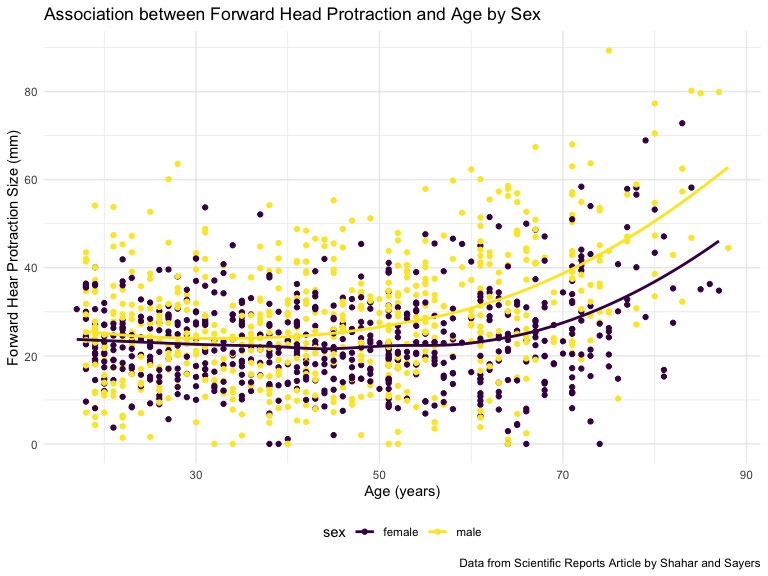
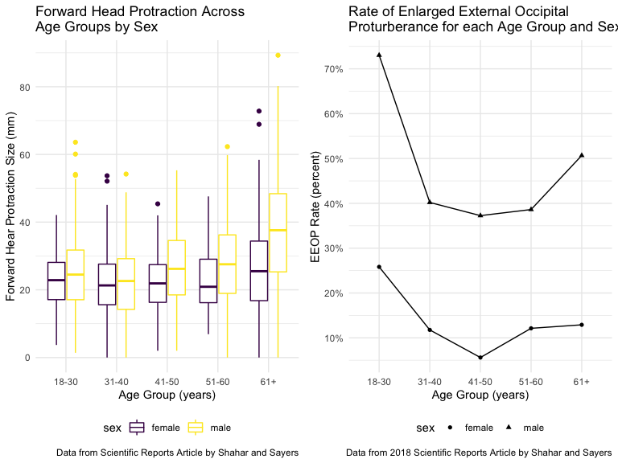
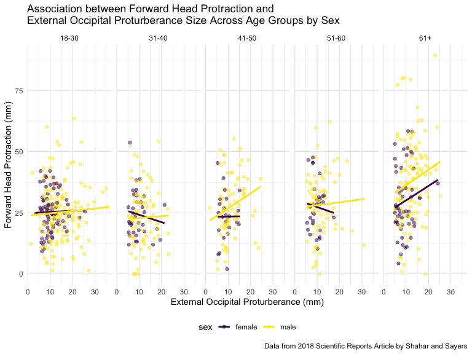
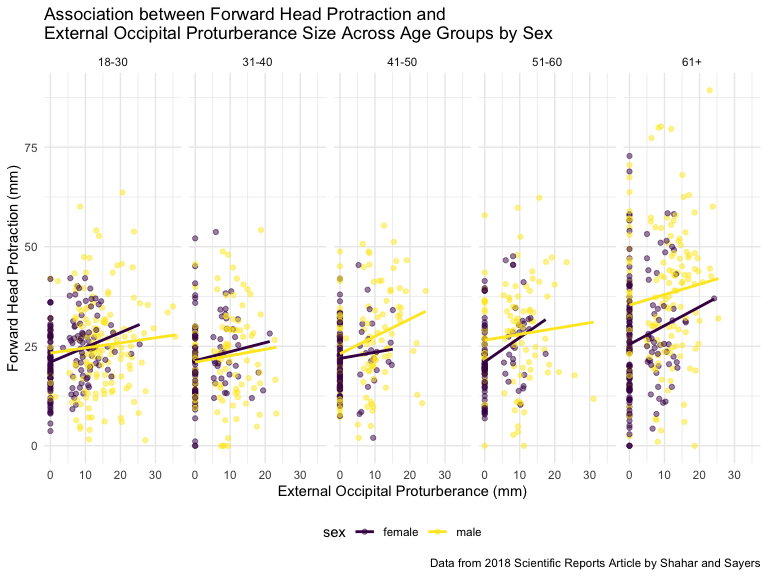
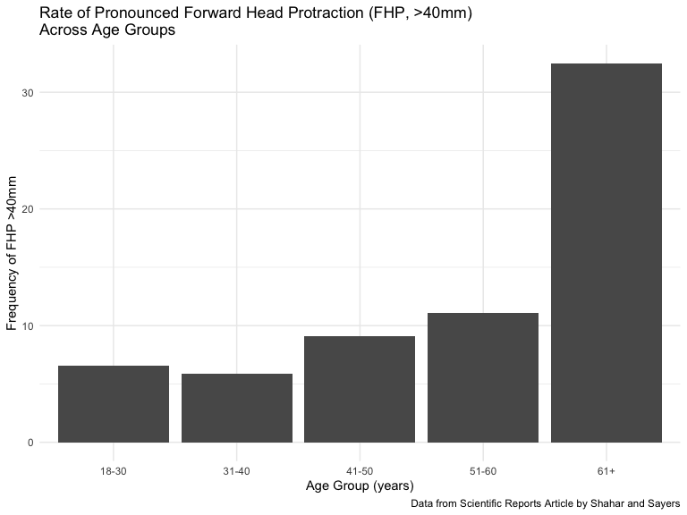

midterm\_practice
================
Kodiak Soled
10/17/2019

``` r
library(readxl)
library(tidyverse)
```

    ## ── Attaching packages ───────────────────────────────────────────── tidyverse 1.2.1 ──

    ## ✔ ggplot2 3.2.1     ✔ purrr   0.3.3
    ## ✔ tibble  2.1.3     ✔ dplyr   0.8.3
    ## ✔ tidyr   1.0.0     ✔ stringr 1.4.0
    ## ✔ readr   1.3.1     ✔ forcats 0.4.0

    ## ── Conflicts ──────────────────────────────────────────────── tidyverse_conflicts() ──
    ## ✖ dplyr::filter() masks stats::filter()
    ## ✖ dplyr::lag()    masks stats::lag()

``` r
library(kableExtra)
```

    ## 
    ## Attaching package: 'kableExtra'

    ## The following object is masked from 'package:dplyr':
    ## 
    ##     group_rows

``` r
library(viridis)
```

    ## Loading required package: viridisLite

``` r
library(patchwork)

knitr::opts_chunk$set(
    echo = TRUE,
    warning = FALSE,
    fig.width = 8, 
  fig.height = 6,
  out.width = "90%"
)

options(
  ggplot2.continuous.colour = "viridis",
  ggplot2.continuous.fill = "viridis"
)

scale_colour_discrete = scale_colour_viridis_d

scale_fill_discrete = scale_fill_viridis_d

theme_set(theme_minimal() + theme(legend.position = "bottom"))
```

``` r
wordcountaddin::text_stats("midterm_practice.Rmd")
```

    ## For information on available language packages for 'koRpus', run
    ## 
    ##   available.koRpus.lang()
    ## 
    ## and see ?install.koRpus.lang()

    ## 
    ## Attaching package: 'koRpus'

    ## The following object is masked from 'package:readr':
    ## 
    ##     tokenize

<table>

<thead>

<tr>

<th style="text-align:left;">

Method

</th>

<th style="text-align:left;">

koRpus

</th>

<th style="text-align:left;">

stringi

</th>

</tr>

</thead>

<tbody>

<tr>

<td style="text-align:left;">

Word count

</td>

<td style="text-align:left;">

498

</td>

<td style="text-align:left;">

428

</td>

</tr>

<tr>

<td style="text-align:left;">

Character count

</td>

<td style="text-align:left;">

2954

</td>

<td style="text-align:left;">

2953

</td>

</tr>

<tr>

<td style="text-align:left;">

Sentence count

</td>

<td style="text-align:left;">

43

</td>

<td style="text-align:left;">

Not available

</td>

</tr>

<tr>

<td style="text-align:left;">

Reading time

</td>

<td style="text-align:left;">

2.5 minutes

</td>

<td style="text-align:left;">

2.1 minutes

</td>

</tr>

</tbody>

</table>

# Problem 1

## Import/Clean Data

  - Read in file
  - `clean_names`
  - `Replace` “eop\_size” missing values with ‘0’
  - Create appropriate character/factor categorical variables
    (`as.character`/`as.factor`)
  - `Recode` “sex”, “age\_group”, “eop\_size”,
    “eop\_visibility\_classification” and “fhp\_category” to reflect
    definitions (e.g., ‘7’/‘8’ recoded as ‘6’)
  - `Recode` miscoded variables (causes problems with figures later on):
      - Participant \#1153 changed from age\_group ‘1’ to ‘4’
      - Participant \#686 changed eop\_size = ‘14.6’ to ‘yes’ for “eeop”
  - Create “eeop” variable
  - `Rename` variables during `recode`’ing

<!-- end list -->

``` r
mtp_data = 
  read_excel("./data/p8105_mtp_data.xlsx", sheet = "this one", range = "A9:I1230") %>%
  janitor::clean_names() %>%
  mutate(
    eop_size_mm = replace(eop_size_mm, is.na(eop_size_mm) == TRUE, 0),
    sex = as.character(sex),
    fhp_category = as.factor(fhp_category), 
   eop_visibility_classification = as.factor(eop_visibility_classification),
    eop_size = as.factor(eop_size),
    age_group = as.factor(age_group),
    sex = recode(sex,
                 `1` = "male",
                 `0` = "female"),
    age_group = recode(age_group,
                       `7` = "6",
                       `8` = "6",
                       `1` = "4"),
    age_category = recode(age_group,
                       `2` = "18-30",
                       `3` = "31-40",
                       `4` = "41-50",
                       `5` = "51-60",
                       `6` = "61+"),
    age_category = forcats::fct_relevel(age_category, c("18-30", "31-40", "41-50", "51-60", "61+")),
    eeop = recode(eop_size,
                  `0` = "no",
                  `1` = "no",
                  `2` = "yes",
                  `3` = "yes",
                  `4` = "yes",
                  `5` = "yes", 
                  `14.6` = "yes"), 
   eop_category = recode(eop_size,
                         `0` = "0-5mm",
                         `1` = "5-10mm",
                         `2` = "10-15mm",
                         `3` = "15-20mm",
                         `4` = "20-25mm",
                         `5` = "25+mm"),
   eop_visibility_classification = recode(eop_visibility_classification,
                                          `0` = "eop_0mm",
                                          `1` = "0<_eop_<=5mm",
                                          `2` = "eop_>5mm"),
   fhp_category = recode(fhp_category,
                         `0` = "0-10mm",
                         `1` = "10-20mm",
                         `2` = "20-30mm",
                         `3` = "30-40mm",
                         `4` = "40-50mm",
                         `5` = "50-60mm",
                         `6` = "60-70mm",
                         `7` = "70-80mm")
   ) %>%
  select(sex, age, age_category, eop_size_mm, eop_category, eop_visibility_classification, eop_shape, eop_shape, fhp_size_mm, fhp_category, eeop)
```

  - This dataset contains 1221 observations and 10 variables including:
    sex; age and age category; eop category, size, classification, and
    shape; fhp size and category; and eeop.

### Issues:

  - Included a 17
    y/o
    <table class="table table-striped table-condensed" style="margin-left: auto; margin-right: auto;">
    <caption>
    Participant 7’s Inclusion of 17-year-old Participant
    </caption>
    <thead>
    <tr>
    <th style="text-align:left;">
    sex
    </th>
    <th style="text-align:right;">
    age
    </th>
    <th style="text-align:left;">
    age\_category
    </th>
    <th style="text-align:right;">
    eop\_size\_mm
    </th>
    <th style="text-align:left;">
    eop\_category
    </th>
    <th style="text-align:left;">
    eop\_visibility\_classification
    </th>
    <th style="text-align:right;">
    eop\_shape
    </th>
    <th style="text-align:right;">
    fhp\_size\_mm
    </th>
    <th style="text-align:left;">
    fhp\_category
    </th>
    <th style="text-align:left;">
    eeop
    </th>
    </tr>
    </thead>
    <tbody>
    <tr>
    <td style="text-align:left;">
    female
    </td>
    <td style="text-align:right;">
    17
    </td>
    <td style="text-align:left;">
    41-50
    </td>
    <td style="text-align:right;">
    6.4
    </td>
    <td style="text-align:left;">
    5-10mm
    </td>
    <td style="text-align:left;">
    eop\_\>5mm
    </td>
    <td style="text-align:right;">
    1
    </td>
    <td style="text-align:right;">
    30.6
    </td>
    <td style="text-align:left;">
    30-40mm
    </td>
    <td style="text-align:left;">
    no
    </td>
    </tr>
    </tbody>
    </table>
  - Several “eop\_category” and “eop\_visibility\_classification” data
    were incorretly implemented (e.g., participant \#3’s
    “eop\_size”=‘0’, but “eop\_visibility\_classification”=‘\>0’
    and \#126’s “eop\_size\_mm”=‘2.11’ but
    “eop\_size”=‘\>5’)
    <table class="table table-striped table-condensed" style="margin-left: auto; margin-right: auto;">
    <caption>
    Participant 3’s EOP Visibility
Misclassification
    </caption>
    <thead>
    <tr>
    <th style="text-align:left;">
    sex
    </th>
    <th style="text-align:right;">
    age
    </th>
    <th style="text-align:left;">
    age\_category
    </th>
    <th style="text-align:right;">
    eop\_size\_mm
    </th>
    <th style="text-align:left;">
    eop\_category
    </th>
    <th style="text-align:left;">
    eop\_visibility\_classification
    </th>
    <th style="text-align:right;">
    eop\_shape
    </th>
    <th style="text-align:right;">
    fhp\_size\_mm
    </th>
    <th style="text-align:left;">
    fhp\_category
    </th>
    <th style="text-align:left;">
    eeop
    </th>
    </tr>
    </thead>
    <tbody>
    <tr>
    <td style="text-align:left;">
    female
    </td>
    <td style="text-align:right;">
    22
    </td>
    <td style="text-align:left;">
    18-30
    </td>
    <td style="text-align:right;">
    0
    </td>
    <td style="text-align:left;">
    0-5mm
    </td>
    <td style="text-align:left;">
    0\<*eop*\<=5mm
    </td>
    <td style="text-align:right;">
    NA
    </td>
    <td style="text-align:right;">
    28.1
    </td>
    <td style="text-align:left;">
    20-30mm
    </td>
    <td style="text-align:left;">
    no
    </td>
    </tr>
    </tbody>
    </table>

<table class="table table-striped table-condensed" style="margin-left: auto; margin-right: auto;">

<caption>

Participant 126’s EOP Size Misclassification

</caption>

<thead>

<tr>

<th style="text-align:left;">

sex

</th>

<th style="text-align:right;">

age

</th>

<th style="text-align:left;">

age\_category

</th>

<th style="text-align:right;">

eop\_size\_mm

</th>

<th style="text-align:left;">

eop\_category

</th>

<th style="text-align:left;">

eop\_visibility\_classification

</th>

<th style="text-align:right;">

eop\_shape

</th>

<th style="text-align:right;">

fhp\_size\_mm

</th>

<th style="text-align:left;">

fhp\_category

</th>

<th style="text-align:left;">

eeop

</th>

</tr>

</thead>

<tbody>

<tr>

<td style="text-align:left;">

male

</td>

<td style="text-align:right;">

18

</td>

<td style="text-align:left;">

18-30

</td>

<td style="text-align:right;">

2.11

</td>

<td style="text-align:left;">

20-25mm

</td>

<td style="text-align:left;">

eop\_\>5mm

</td>

<td style="text-align:right;">

2

</td>

<td style="text-align:right;">

41.4

</td>

<td style="text-align:left;">

40-50mm

</td>

<td style="text-align:left;">

yes

</td>

</tr>

</tbody>

</table>

  - n=1221, but n=1200 reported in
paper

<table class="table table-striped table-condensed" style="margin-left: auto; margin-right: auto;">

<caption>

Total Observations

</caption>

<thead>

<tr>

<th style="text-align:right;">

n

</th>

</tr>

</thead>

<tbody>

<tr>

<td style="text-align:right;">

1221

</td>

</tr>

</tbody>

</table>

  - Poor variable definitions (e.g., eop\_size: ‘1’=‘5-10’, ‘2’=‘10-15’)

### Age/Gender Distribution

``` r
mtp_data %>%
  select(sex, age_category) %>%
  group_by(age_category, sex) %>%
  summarize(n = n()) %>%
  pivot_wider(
    names_from = sex,
    values_from = n
  ) %>%
  knitr::kable(caption = "Age Group and Gender Distribution") %>%
  kable_styling(bootstrap_options = c("striped", "condensed", font_size = 12))
```

<table class="table table-striped table-condensed" style="margin-left: auto; margin-right: auto;">

<caption>

Age Group and Gender
Distribution

</caption>

<thead>

<tr>

<th style="text-align:left;">

age\_category

</th>

<th style="text-align:right;">

female

</th>

<th style="text-align:right;">

male

</th>

</tr>

</thead>

<tbody>

<tr>

<td style="text-align:left;">

18-30

</td>

<td style="text-align:right;">

151

</td>

<td style="text-align:right;">

152

</td>

</tr>

<tr>

<td style="text-align:left;">

31-40

</td>

<td style="text-align:right;">

102

</td>

<td style="text-align:right;">

102

</td>

</tr>

<tr>

<td style="text-align:left;">

41-50

</td>

<td style="text-align:right;">

107

</td>

<td style="text-align:right;">

102

</td>

</tr>

<tr>

<td style="text-align:left;">

51-60

</td>

<td style="text-align:right;">

99

</td>

<td style="text-align:right;">

101

</td>

</tr>

<tr>

<td style="text-align:left;">

61+

</td>

<td style="text-align:right;">

155

</td>

<td style="text-align:right;">

150

</td>

</tr>

</tbody>

</table>

# Problem 2


``` r
figure_3 = 
  mtp_data %>%
  ggplot(aes(x = age_category, y = fhp_size_mm, color = sex)) + 
  geom_boxplot() +
  labs(
    title = "Forward Head Protraction Across \nAge Groups by Sex", 
    x = "Age Group (years)",
    y = "Forward Hear Protraction Size (mm)", 
    caption = "Data from Scientific Reports Article by Shahar and Sayers") +
  scale_y_continuous(
    breaks = c(0, 20, 40, 60, 80),
    labels = c("0", "20", "40", "60", "80"))

figure_3
```


``` r
 mtp_data %>%
  ggplot(aes(x = age, y = fhp_size_mm, color = sex)) + 
  geom_point() +  
  geom_smooth(se = FALSE) +
  labs(
    title = "Association between Forward Head Protraction and Age by Sex", 
    x = "Age (years)",
    y = "Forward Hear Protraction Size (mm)", 
    caption = "Data from Scientific Reports Article by Shahar and Sayers") +
  scale_y_continuous(
    breaks = c(0, 20, 40, 60, 80),
    labels = c("0", "20", "40", "60", "80"))
```

    ## `geom_smooth()` using method = 'loess' and formula 'y ~ x'



### These show fhp\_size doesn’t increase until age 55 and is only slightly larger in males.


``` r
figure_4 = 
  mtp_data %>%
  group_by(age_category, sex, eeop) %>%
  count() %>%
  pivot_wider(
    names_from = eeop,
    values_from = n
  ) %>%
  mutate(
    total = no + yes, 
    rate = (yes / total) * 100
  ) %>%
  ggplot(aes(x = age_category, y = rate, group = sex)) + 
  geom_line() +
  geom_point(aes(shape = sex)) +
  labs(
    title = "Rate of Enlarged External Occipital \nProturberance for each Age Group and Sex", 
    x = "Age Group (years)",
    y = "EEOP Rate (percent)", 
    caption = "Data from 2018 Scientific Reports Article by Shahar and Sayers") +
  scale_y_continuous(
    breaks = c(0, 10, 20, 30, 40, 50, 60, 70),
    labels = c("0", "10%", "20%", "30%", "40%", "50%", "60%", "70%"))

figure_4
```


### The eeop rate is higher in every age group for males, and is highest in 18-30 y/o’s.

## Two-Paneled Figure

``` r
figure_3 + figure_4
```



## FHP/EOP Association

``` r
fhp_eop_association = 
  mtp_data %>%
  filter(
    eop_size_mm > 0
    ) %>%
  ggplot(aes(x = eop_size_mm, y = fhp_size_mm, color = sex)) + 
  geom_point(alpha = .5) + 
  geom_smooth(method = "lm", se = FALSE) +
  facet_grid(~age_category) + 
  labs(
    title = "Association between Forward Head Protraction and \nExternal Occipital Proturberance Size Across Age Groups by Sex", 
    x = "External Occipital Proturberance (mm)",
    y = "Forward Head Protraction (mm)", 
    caption = "Data from 2018 Scientific Reports Article by Shahar and Sayers")
fhp_eop_association
```



### There’s a positive association between FHP and EOP in each age group by sex except 31-40 y/o’s and females aged 41-60. The association is strongest in males and 61+’s.

### “eop\_size” = ‘0’ was removed as these are missing values. Including ’0’s would falsely make all associations positive:



# Problem 3

## Sample Size

``` r
mtp_data %>%
  select(age_category) %>%
  group_by(age_category) %>%
  summarize(n = n()) %>%
  knitr::kable(caption = "Age Distribution of Sample") %>%
  kable_styling(bootstrap_options = c("striped", "condensed", font_size = 12))
```

<table class="table table-striped table-condensed" style="margin-left: auto; margin-right: auto;">

<caption>

Age Distribution of Sample

</caption>

<thead>

<tr>

<th style="text-align:left;">

age\_category

</th>

<th style="text-align:right;">

n

</th>

</tr>

</thead>

<tbody>

<tr>

<td style="text-align:left;">

18-30

</td>

<td style="text-align:right;">

303

</td>

</tr>

<tr>

<td style="text-align:left;">

31-40

</td>

<td style="text-align:right;">

204

</td>

</tr>

<tr>

<td style="text-align:left;">

41-50

</td>

<td style="text-align:right;">

209

</td>

</tr>

<tr>

<td style="text-align:left;">

51-60

</td>

<td style="text-align:right;">

200

</td>

</tr>

<tr>

<td style="text-align:left;">

61+

</td>

<td style="text-align:right;">

305

</td>

</tr>

</tbody>

</table>

### Author’s report n=1200. We have n=1221.

### Author’s reported age group sizes different than our results.

## FHP

``` r
mtp_data %>%
  filter(fhp_size_mm > 0) %>%
  group_by(sex) %>%
  summarize(
    mean_fhp = mean(fhp_size_mm), 
    sd_fhp = sd(fhp_size_mm)
    ) %>%
  knitr::kable(digits = 1, caption = "Mean and Standard Deviation of Sample by Gender") %>%
  kable_styling(bootstrap_options = c("striped", "condensed", font_size = 12))
```

<table class="table table-striped table-condensed" style="margin-left: auto; margin-right: auto;">

<caption>

Mean and Standard Deviation of Sample by Gender

</caption>

<thead>

<tr>

<th style="text-align:left;">

sex

</th>

<th style="text-align:right;">

mean\_fhp

</th>

<th style="text-align:right;">

sd\_fhp

</th>

</tr>

</thead>

<tbody>

<tr>

<td style="text-align:left;">

female

</td>

<td style="text-align:right;">

23.9

</td>

<td style="text-align:right;">

10.4

</td>

</tr>

<tr>

<td style="text-align:left;">

male

</td>

<td style="text-align:right;">

28.8

</td>

<td style="text-align:right;">

14.4

</td>

</tr>

</tbody>

</table>

``` r
mtp_data %>%
  filter(fhp_size_mm > 0) %>%
  summarize(
    mean_fhp = mean(fhp_size_mm), 
    sd_fhp = sd(fhp_size_mm)
    ) %>%
  knitr::kable(digits = 1, caption = "Mean and Standard Deviation of Entire Sample") %>%
  kable_styling(bootstrap_options = c("striped", "condensed", font_size = 12))
```

<table class="table table-striped table-condensed" style="margin-left: auto; margin-right: auto;">

<caption>

Mean and Standard Deviation of Entire
Sample

</caption>

<thead>

<tr>

<th style="text-align:right;">

mean\_fhp

</th>

<th style="text-align:right;">

sd\_fhp

</th>

</tr>

</thead>

<tbody>

<tr>

<td style="text-align:right;">

26.4

</td>

<td style="text-align:right;">

12.8

</td>

</tr>

</tbody>

</table>

### The reported mean FHP by gender and overall was slightly off from our results.

## EEOP Prevalence

``` r
mtp_data %>%
  group_by(eeop) %>%
  count() %>%
  pivot_wider(
    names_from = eeop,
    values_from = n
  ) %>%
  mutate(
    total = no + yes, 
    rate = (yes / total) * 100
  ) %>%
  knitr::kable(digits = 1, caption = "Prevalence of EEOP") %>%
  kable_styling(bootstrap_options = c("striped", "condensed", font_size = 12))
```

<table class="table table-striped table-condensed" style="margin-left: auto; margin-right: auto;">

<caption>

Prevalence of
EEOP

</caption>

<thead>

<tr>

<th style="text-align:right;">

no

</th>

<th style="text-align:right;">

yes

</th>

<th style="text-align:right;">

total

</th>

<th style="text-align:right;">

rate

</th>

</tr>

</thead>

<tbody>

<tr>

<td style="text-align:right;">

827

</td>

<td style="text-align:right;">

394

</td>

<td style="text-align:right;">

1221

</td>

<td style="text-align:right;">

32.3

</td>

</tr>

</tbody>

</table>

### Definition of EEOP: “bony outgrowths \>10mm.”

### “eop\_size” and “eop\_visibility\_classification” were not categorized this way. A new variable “eeop” was created during data cleaning to meet this definition.

### The 32.3% prevalence is close from the reported 33%.

## FHP Trends

``` r
mtp_data %>%
  mutate(
    fhp_40 = recode(fhp_category,
                    `0-10mm` = "no",
                    `10-20mm` = "no",
                    `20-30mm` = "no",
                    `30-40mm` = "no",
                    `40-50mm` = "yes",
                    `50-60mm` = "yes",
                    `60-70mm` = "yes",
                    `70-80mm` = "yes",)
  ) %>%
  group_by(fhp_40, age_category) %>%
  count() %>%
  pivot_wider(
    names_from = fhp_40,
    values_from = n
  ) %>%
  mutate(
    total = no + yes, 
    rate = (yes / total) * 100
  ) %>%
  ggplot(aes(x = age_category, y = rate)) +
  geom_histogram(stat = "identity") +
  labs(
    title = "Rate of Pronounced Forward Head Protraction (FHP, >40mm) \nAcross Age Groups", 
    x = "Age Group (years)",
    y = "Frequency of FHP >40mm", 
    caption = "Data from Scientific Reports Article by Shahar and Sayers")
```



### Again, the numbers are slightly off (32.5% found vs 34.5% reported).

### They claim is consistent with our data (FHP\>40 mm was observed frequently in those 61+)

### Broadly speaking, there’s an increase in FHP for those 61+.

# Problem 4

### FHP increases with age, is higher in males (as is eeop rate), and positively associated with EOP size in those 61+; however, the authors contort the data to make their results seem more extreme.

### They excluded participants without explanation and miscoded categorical variables which creates doubts about the quality of their analysis.

### It’s impossible to know if cellphones cause horn growth from this poorly analyzed retrospective study (causation only possible in RCT’s).
