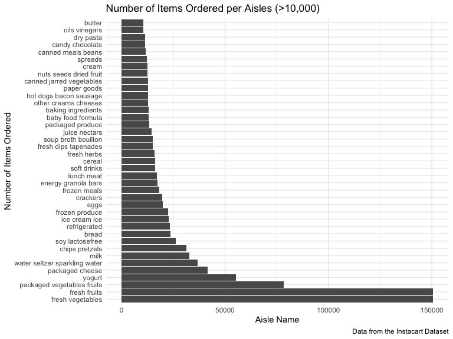
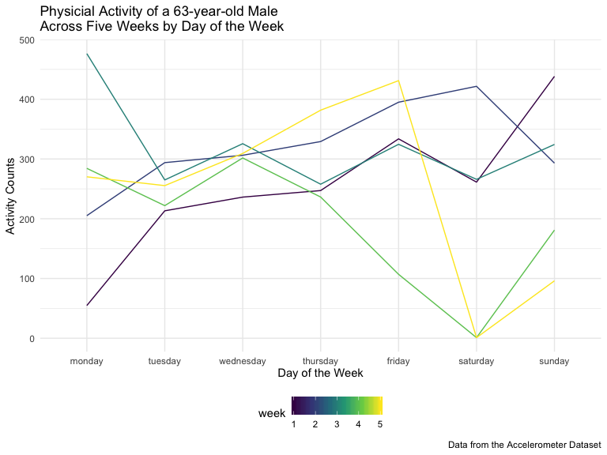
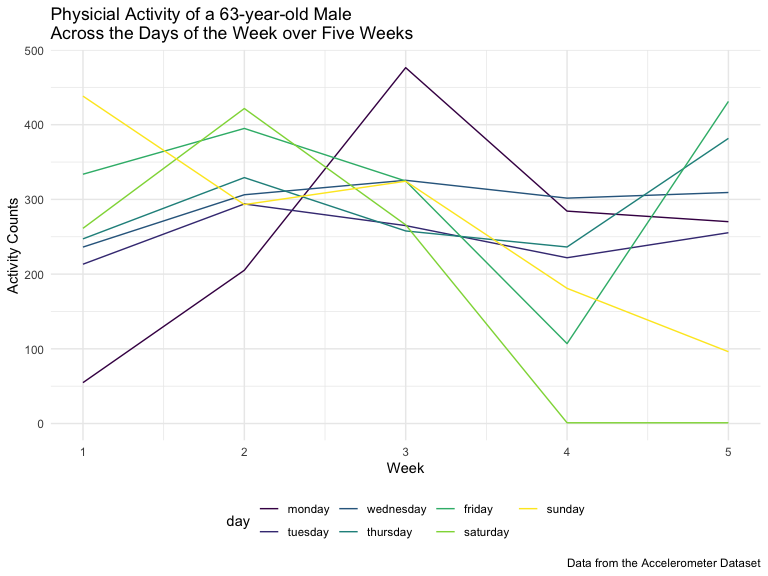

new\_hw3
================
Kodiak Soled
10/8/2019

*Note to TAs: you may need to* `install.packages(kableExtra)` *to run my
code.*

### Loading in the settings for this R Markdown document:

``` r
library(viridis)
```

    ## Loading required package: viridisLite

``` r
library(tidyverse)
```

    ## ── Attaching packages ────────────────────── tidyverse 1.2.1 ──

    ## ✔ ggplot2 3.2.1     ✔ purrr   0.3.2
    ## ✔ tibble  2.1.3     ✔ dplyr   0.8.3
    ## ✔ tidyr   1.0.0     ✔ stringr 1.4.0
    ## ✔ readr   1.3.1     ✔ forcats 0.4.0

    ## ── Conflicts ───────────────────────── tidyverse_conflicts() ──
    ## ✖ dplyr::filter() masks stats::filter()
    ## ✖ dplyr::lag()    masks stats::lag()

``` r
library(kableExtra)
```

    ## 
    ## Attaching package: 'kableExtra'

    ## The following object is masked from 'package:dplyr':
    ## 
    ##     group_rows

``` r
knitr::opts_chunk$set(
    echo = TRUE,
    warning = FALSE,
    fig.width = 8, 
  fig.height = 6,
  out.width = "90%"
)

options(
  ggplot2.continuous.colour = "viridis",
  ggplot2.continuous.fill = "viridis"
)

scale_colour_discrete = scale_colour_viridis_d

scale_fill_discrete = scale_fill_viridis_d

theme_set(theme_minimal() + theme(legend.position = "bottom"))
```

# Problem \#1

## Instacart Dataset

### We first need to read in and tidy the instacart dataset in order to explore :

``` r
library(p8105.datasets)
data("instacart")

cleaned_instacart = 
  instacart %>%
  janitor::clean_names() %>%
  mutate(
    product_name = str_to_lower(product_name)
  )
```

### Description

  - There are 1384617 observations and 15 variables for a totoal of NA
    in the Instacart dataset.
  - Some key variables in this dataset include the order and product
    identifier, the name of the product, the name and identifier of the
    department and aisle, and several variables that include information
    about the ordering of the product.
  - An illustrative example in this dataset is that a organic hass
    avocados (product identifier \#47209) was purchased by customer
    \#112108 at 10 am on the 4th day of the week. This produce is
    located in the fresh fruit aisle (aisle identifier \#24) which is
    part of the produce department (department identifier \#4). Overall,
    there were 7293 organic hass avocados ordered. Another way of
    looking at this dataset is that customer \#112108 placed an order at
    10 am (order identifier \#1) which had eight items in it (bulgarian
    yogurt, organic 4% milk fat whole milk cottage cheese, organic
    celery hearts, cucumber kirby, lightly smoked sardines in olive oil,
    bag of organic bananas, organic hass avocado, and organic whole
    string cheese) from the three departments of dairy eggs, produce,
    and canned
goods.

## Answering Problem 1 Questions:

### Determing the number of aisles in the Instacart dataaset and which aisles most items are ordered from:

``` r
aisle = 
  cleaned_instacart %>% 
  group_by(aisle) %>%
  count() %>%
  arrange(desc(n)) %>%
  as_tibble()
```

  - There are 134 aisles in this dataset. The most orders are from the
    fresh vegetables and fresh fruits
aisles.

### Making a scatterplot that shows the number of items ordered in each aisle for aisles with more than 10,000 items ordered:

``` r
cleaned_instacart %>%
  count(aisle) %>%
  filter(n > 10000) %>%
  mutate(aisle = forcats::fct_reorder(aisle, n, .desc = TRUE)) %>%
  ggplot(aes(x = aisle, y = n)) + coord_flip() +
  geom_bar(stat = "identity") +
  labs(
    title = "Number of Items Ordered per Aisles (>10,000)",
    x = "Number of Items Ordered",
    y = "Aisle Name", 
    caption = "Data from the Instacart Dataset"
    )
```



### Making a table with the three most popular items in each of the aisles “baking ingredients”, “dog food care”, and “packaged vegetables fruits”:

``` r
popularity_food = 
  cleaned_instacart %>%
  select(aisle, product_name) %>%
  filter(
    aisle == "baking ingredients" |
      aisle == "packaged vegetables fruits" |
      aisle == "dog food care"
    ) %>%
  count(product_name, aisle) %>%
  group_by(aisle) %>%
  top_n(n = 3) %>%
  mutate(
    rank(desc(n))
    ) %>%
  rename(rank = 'rank(desc(n))') %>%
  select(aisle, product_name, n, rank) %>%
  arrange(aisle, desc(n)) %>%
  knitr::kable(caption = "Three Most Popular Items among Aisles: Baking Ingredients, Packaged Vegetable Fruits, and Dog Food Car") %>%
  kable_styling(bootstrap_options = c("striped", "condensed", font_size = 12))
```

    ## Selecting by n

``` r
popularity_food
```

<table class="table table-striped table-condensed" style="margin-left: auto; margin-right: auto;">

<caption>

Three Most Popular Items among Aisles: Baking Ingredients, Packaged
Vegetable Fruits, and Dog Food Car

</caption>

<thead>

<tr>

<th style="text-align:left;">

aisle

</th>

<th style="text-align:left;">

product\_name

</th>

<th style="text-align:right;">

n

</th>

<th style="text-align:right;">

rank

</th>

</tr>

</thead>

<tbody>

<tr>

<td style="text-align:left;">

baking ingredients

</td>

<td style="text-align:left;">

light brown sugar

</td>

<td style="text-align:right;">

499

</td>

<td style="text-align:right;">

1

</td>

</tr>

<tr>

<td style="text-align:left;">

baking ingredients

</td>

<td style="text-align:left;">

pure baking soda

</td>

<td style="text-align:right;">

387

</td>

<td style="text-align:right;">

2

</td>

</tr>

<tr>

<td style="text-align:left;">

baking ingredients

</td>

<td style="text-align:left;">

cane sugar

</td>

<td style="text-align:right;">

336

</td>

<td style="text-align:right;">

3

</td>

</tr>

<tr>

<td style="text-align:left;">

dog food care

</td>

<td style="text-align:left;">

snack sticks chicken & rice recipe dog treats

</td>

<td style="text-align:right;">

30

</td>

<td style="text-align:right;">

1

</td>

</tr>

<tr>

<td style="text-align:left;">

dog food care

</td>

<td style="text-align:left;">

organix chicken & brown rice recipe

</td>

<td style="text-align:right;">

28

</td>

<td style="text-align:right;">

2

</td>

</tr>

<tr>

<td style="text-align:left;">

dog food care

</td>

<td style="text-align:left;">

small dog biscuits

</td>

<td style="text-align:right;">

26

</td>

<td style="text-align:right;">

3

</td>

</tr>

<tr>

<td style="text-align:left;">

packaged vegetables fruits

</td>

<td style="text-align:left;">

organic baby spinach

</td>

<td style="text-align:right;">

9784

</td>

<td style="text-align:right;">

1

</td>

</tr>

<tr>

<td style="text-align:left;">

packaged vegetables fruits

</td>

<td style="text-align:left;">

organic raspberries

</td>

<td style="text-align:right;">

5546

</td>

<td style="text-align:right;">

2

</td>

</tr>

<tr>

<td style="text-align:left;">

packaged vegetables fruits

</td>

<td style="text-align:left;">

organic
blueberries

</td>

<td style="text-align:right;">

4966

</td>

<td style="text-align:right;">

3

</td>

</tr>

</tbody>

</table>

### Here is a table of the mean hour of the day at which Pink Lady Apples and Coffee Ice Cream are ordered on each day of the week:

``` r
apples_and_ice_cream = 
  cleaned_instacart %>%
  filter(
    product_name == "pink lady apples" | 
      product_name == "coffee ice cream"
    ) %>%
  mutate(
    day_of_week = recode(order_dow,
                         `1` = "monday", 
                         `2` = "tuesday", 
                         `3` = "wednesday", 
                         `4` = "thursday", 
                         `5` = "friday", 
                         `6` = "saturday",
                         `0` = "sunday"),
    day_of_week = forcats::fct_relevel(day_of_week, c("monday", "tuesday", "wednesday", "thursday", "friday", "saturday", "sunday"))
    ) %>%
  select(day_of_week, product_name, order_hour_of_day) %>%
  group_by(product_name, day_of_week) %>%
  summarize(mean_hour = mean(order_hour_of_day)) %>%
  arrange(day_of_week) %>%
  pivot_wider(
    names_from = "product_name",
    values_from = "mean_hour"
  ) %>%
   knitr::kable(digit = 1, caption = "Mean Hour of Day Pink Lady Apples and Coffee Ice Cream is Ordered Each Day of Week") %>% 
  kable_styling(bootstrap_options = c("striped", "condensed", font_size = 12))

apples_and_ice_cream
```

<table class="table table-striped table-condensed" style="margin-left: auto; margin-right: auto;">

<caption>

Mean Hour of Day Pink Lady Apples and Coffee Ice Cream is Ordered Each
Day of Week

</caption>

<thead>

<tr>

<th style="text-align:left;">

day\_of\_week

</th>

<th style="text-align:right;">

coffee ice cream

</th>

<th style="text-align:right;">

pink lady apples

</th>

</tr>

</thead>

<tbody>

<tr>

<td style="text-align:left;">

monday

</td>

<td style="text-align:right;">

14.3

</td>

<td style="text-align:right;">

11.4

</td>

</tr>

<tr>

<td style="text-align:left;">

tuesday

</td>

<td style="text-align:right;">

15.4

</td>

<td style="text-align:right;">

11.7

</td>

</tr>

<tr>

<td style="text-align:left;">

wednesday

</td>

<td style="text-align:right;">

15.3

</td>

<td style="text-align:right;">

14.2

</td>

</tr>

<tr>

<td style="text-align:left;">

thursday

</td>

<td style="text-align:right;">

15.2

</td>

<td style="text-align:right;">

11.6

</td>

</tr>

<tr>

<td style="text-align:left;">

friday

</td>

<td style="text-align:right;">

12.3

</td>

<td style="text-align:right;">

12.8

</td>

</tr>

<tr>

<td style="text-align:left;">

saturday

</td>

<td style="text-align:right;">

13.8

</td>

<td style="text-align:right;">

11.9

</td>

</tr>

<tr>

<td style="text-align:left;">

sunday

</td>

<td style="text-align:right;">

13.8

</td>

<td style="text-align:right;">

13.4

</td>

</tr>

</tbody>

</table>

# Problem 2

## BRFSS Dataset

``` r
library(p8105.datasets)
data("brfss_smart2010")
```

### Cleaning data to have appropriate variable names, focus on the “Overall Health” topic, and organize responses from “poor” to “excellent”

``` r
brfss = 
  brfss_smart2010 %>%
  janitor::clean_names() %>%
  filter(topic == "Overall Health") %>%
  mutate_all(tolower) %>%
  mutate(
    response = forcats::fct_relevel(response, c("poor", "fair", "good", "very good", "excellent"))
    ) %>%
  rename(
    state = locationabbr, 
    location = locationdesc
    )
```

## Answering Problem 2 Questions:

### Determining which states were observed at 7 or more locations in 2002 and in 2010:

``` r
states_2002_locations = 
  brfss %>%
  filter(year == 2002) %>%
  group_by(state) %>%
  summarize(num_location = n_distinct(location)) %>%
  filter(num_location >= 7) 

states_2002_locations
```

    ## # A tibble: 6 x 2
    ##   state num_location
    ##   <chr>        <int>
    ## 1 ct               7
    ## 2 fl               7
    ## 3 ma               8
    ## 4 nc               7
    ## 5 nj               8
    ## 6 pa              10

``` r
states_2010_locations =
  brfss %>%
  filter(year == 2010) %>%
  group_by(state) %>%
  summarize(location = n_distinct(location)) %>%
  filter(location >= 7) 

states_2010_locations
```

    ## # A tibble: 14 x 2
    ##    state location
    ##    <chr>    <int>
    ##  1 ca          12
    ##  2 co           7
    ##  3 fl          41
    ##  4 ma           9
    ##  5 md          12
    ##  6 nc          12
    ##  7 ne          10
    ##  8 nj          19
    ##  9 ny           9
    ## 10 oh           8
    ## 11 pa           7
    ## 12 sc           7
    ## 13 tx          16
    ## 14 wa          10

### Description

  - There were 6 states in 2002 that were observed at 7 or more
    locations. These states included: ct, ft, ma, nc, nj, pa.

  - There were 14 states in 2010 that were observed at 7 or more
    locations. These states included: ca, co, fl, ma, md, nc, ne, nj,
    ny, oh, pa, sc, tx,
wa.

### Making a dataset that is limited to `Excellent` responses, and contains, year, state, and a variable `mean_data_value` that averages the `data_value` across locations within a state:

``` r
excellent_brfss =
  brfss %>%
  filter(response == "excellent") %>%
  select(year, state, data_value) %>%
  mutate(
    data_value = as.numeric(data_value),
    year = as.factor(year),
    state = as.factor(state)
  ) %>%
  group_by(state, year) %>%
  summarize(
    mean_data_value = mean(data_value)
    )

excellent_brfss
```

    ## # A tibble: 443 x 3
    ## # Groups:   state [51]
    ##    state year  mean_data_value
    ##    <fct> <fct>           <dbl>
    ##  1 ak    2002             27.9
    ##  2 ak    2003             24.8
    ##  3 ak    2004             23.0
    ##  4 ak    2005             23.8
    ##  5 ak    2007             23.5
    ##  6 ak    2008             20.6
    ##  7 ak    2009             23.2
    ##  8 al    2002             18.5
    ##  9 al    2003             19.5
    ## 10 al    2004             20  
    ## # … with 433 more rows

### Making a “spaghetti” plot of the `mean_data_value` over time within a state:

``` r
ggplot(excellent_brfss, aes(x = year, y = mean_data_value, group = state, color = state)) +
  geom_line() + 
  labs(
    title = "Prevalence of Adult US Residents by State from 2002-2010",
    x = "Year",
    y = "Mean Prevalence", 
    caption = "Data from the BRFSS Dataset")
```


### Making a two-panel plot showing, for the years 2006, and 2010, distribution of `data_value` for responses (“Poor” to “Excellent”) among locations in NY State:

``` r
brfss %>%
  filter(state == "ny", 
         year == 2010 |
           year == 2006
         ) %>%
  select(year, location, data_value, response) %>%
  mutate(
    data_value = as.numeric(data_value),
    year = as.factor(year),
    location = as.factor(location)
    ) %>%
  ggplot(aes(x = response, y = data_value)) +
  geom_boxplot() +
  facet_grid(. ~year) + 
  labs(
    title = "Quality of General Health of Adult US Residents among locations in NY in 2006 and 2010",
    x = "Quality of General Health",
    y = "Prevalence",
    caption = "Data from the BRFSS Dataset")
```


# Problem 3

## Accelerometer Data

### Loading and tidying the Accelerometer dataset to include:

  - all originally observed variables and values
  - useful variable names
  - a weekday vs weekend variable
  - reasonable variable classes

<!-- end list -->

``` r
accel_data = 
  read_csv("./data/accel_data.csv") %>%
  janitor::clean_names() %>%
  mutate_at(vars(starts_with("activity")), funs(round(., 1))) %>%
  mutate(
    day = str_to_lower(day),
    day_type = case_when(
      day %in% c("monday", "tuesday", "wednesday", "thursday", "friday") ~ "weekday",
      day %in% c("saturday", "sunday") ~ "weekend", 
      TRUE ~ ""
      ),
    day = forcats::fct_relevel(day, c("monday", "tuesday", "wednesday", "thursday", "friday", "saturday", "sunday"))
    ) %>%
  select(week, day_id, day, day_type, everything()) %>%
  arrange(week, day) %>%
  pivot_longer(
    cols = starts_with("activity_"),
    names_to = "minute_of_day",
    names_prefix = "activity_",
    values_to = "activity_count"
  )
```

    ## Parsed with column specification:
    ## cols(
    ##   .default = col_double(),
    ##   day = col_character()
    ## )

    ## See spec(...) for full column specifications.

``` r
accel_data
```

    ## # A tibble: 50,400 x 6
    ##     week day_id day    day_type minute_of_day activity_count
    ##    <dbl>  <dbl> <fct>  <chr>    <chr>                  <dbl>
    ##  1     1      2 monday weekday  1                          1
    ##  2     1      2 monday weekday  2                          1
    ##  3     1      2 monday weekday  3                          1
    ##  4     1      2 monday weekday  4                          1
    ##  5     1      2 monday weekday  5                          1
    ##  6     1      2 monday weekday  6                          1
    ##  7     1      2 monday weekday  7                          1
    ##  8     1      2 monday weekday  8                          1
    ##  9     1      2 monday weekday  9                          1
    ## 10     1      2 monday weekday  10                         1
    ## # … with 50,390 more rows

### Description

  - There are 50400 observations and 6 variables in the Acceleration
    dataset. The key variables include: the day, day id, week number,
    type of week day, and 1440 different
activities.

### Aggregating data accross minutes to create a total activity variable for each day, and create a table showing these totals:

``` r
aggregate_accel_data =
  accel_data %>%
  group_by(week, day, day_type) %>%
  summarize(total_activity = sum(activity_count)) %>%
  arrange(week, day)

aggregate_accel_data %>%
    knitr::kable(caption = "Total Activity (mean minuutes) Count in a 24-Hour Period for Five Weeks") %>%
  kable_styling(bootstrap_options = c("striped", "condensed", font_size = 12))
```

<table class="table table-striped table-condensed" style="margin-left: auto; margin-right: auto;">

<caption>

Total Activity (mean minuutes) Count in a 24-Hour Period for Five
Weeks

</caption>

<thead>

<tr>

<th style="text-align:right;">

week

</th>

<th style="text-align:left;">

day

</th>

<th style="text-align:left;">

day\_type

</th>

<th style="text-align:right;">

total\_activity

</th>

</tr>

</thead>

<tbody>

<tr>

<td style="text-align:right;">

1

</td>

<td style="text-align:left;">

monday

</td>

<td style="text-align:left;">

weekday

</td>

<td style="text-align:right;">

78829.2

</td>

</tr>

<tr>

<td style="text-align:right;">

1

</td>

<td style="text-align:left;">

tuesday

</td>

<td style="text-align:left;">

weekday

</td>

<td style="text-align:right;">

307093.7

</td>

</tr>

<tr>

<td style="text-align:right;">

1

</td>

<td style="text-align:left;">

wednesday

</td>

<td style="text-align:left;">

weekday

</td>

<td style="text-align:right;">

340115.1

</td>

</tr>

<tr>

<td style="text-align:right;">

1

</td>

<td style="text-align:left;">

thursday

</td>

<td style="text-align:left;">

weekday

</td>

<td style="text-align:right;">

355924.4

</td>

</tr>

<tr>

<td style="text-align:right;">

1

</td>

<td style="text-align:left;">

friday

</td>

<td style="text-align:left;">

weekday

</td>

<td style="text-align:right;">

480542.6

</td>

</tr>

<tr>

<td style="text-align:right;">

1

</td>

<td style="text-align:left;">

saturday

</td>

<td style="text-align:left;">

weekend

</td>

<td style="text-align:right;">

376254.0

</td>

</tr>

<tr>

<td style="text-align:right;">

1

</td>

<td style="text-align:left;">

sunday

</td>

<td style="text-align:left;">

weekend

</td>

<td style="text-align:right;">

631105.0

</td>

</tr>

<tr>

<td style="text-align:right;">

2

</td>

<td style="text-align:left;">

monday

</td>

<td style="text-align:left;">

weekday

</td>

<td style="text-align:right;">

295431.0

</td>

</tr>

<tr>

<td style="text-align:right;">

2

</td>

<td style="text-align:left;">

tuesday

</td>

<td style="text-align:left;">

weekday

</td>

<td style="text-align:right;">

423245.0

</td>

</tr>

<tr>

<td style="text-align:right;">

2

</td>

<td style="text-align:left;">

wednesday

</td>

<td style="text-align:left;">

weekday

</td>

<td style="text-align:right;">

440962.0

</td>

</tr>

<tr>

<td style="text-align:right;">

2

</td>

<td style="text-align:left;">

thursday

</td>

<td style="text-align:left;">

weekday

</td>

<td style="text-align:right;">

474048.0

</td>

</tr>

<tr>

<td style="text-align:right;">

2

</td>

<td style="text-align:left;">

friday

</td>

<td style="text-align:left;">

weekday

</td>

<td style="text-align:right;">

568839.0

</td>

</tr>

<tr>

<td style="text-align:right;">

2

</td>

<td style="text-align:left;">

saturday

</td>

<td style="text-align:left;">

weekend

</td>

<td style="text-align:right;">

607175.0

</td>

</tr>

<tr>

<td style="text-align:right;">

2

</td>

<td style="text-align:left;">

sunday

</td>

<td style="text-align:left;">

weekend

</td>

<td style="text-align:right;">

422018.0

</td>

</tr>

<tr>

<td style="text-align:right;">

3

</td>

<td style="text-align:left;">

monday

</td>

<td style="text-align:left;">

weekday

</td>

<td style="text-align:right;">

685910.0

</td>

</tr>

<tr>

<td style="text-align:right;">

3

</td>

<td style="text-align:left;">

tuesday

</td>

<td style="text-align:left;">

weekday

</td>

<td style="text-align:right;">

381507.0

</td>

</tr>

<tr>

<td style="text-align:right;">

3

</td>

<td style="text-align:left;">

wednesday

</td>

<td style="text-align:left;">

weekday

</td>

<td style="text-align:right;">

468869.0

</td>

</tr>

<tr>

<td style="text-align:right;">

3

</td>

<td style="text-align:left;">

thursday

</td>

<td style="text-align:left;">

weekday

</td>

<td style="text-align:right;">

371230.0

</td>

</tr>

<tr>

<td style="text-align:right;">

3

</td>

<td style="text-align:left;">

friday

</td>

<td style="text-align:left;">

weekday

</td>

<td style="text-align:right;">

467420.0

</td>

</tr>

<tr>

<td style="text-align:right;">

3

</td>

<td style="text-align:left;">

saturday

</td>

<td style="text-align:left;">

weekend

</td>

<td style="text-align:right;">

382928.0

</td>

</tr>

<tr>

<td style="text-align:right;">

3

</td>

<td style="text-align:left;">

sunday

</td>

<td style="text-align:left;">

weekend

</td>

<td style="text-align:right;">

467052.0

</td>

</tr>

<tr>

<td style="text-align:right;">

4

</td>

<td style="text-align:left;">

monday

</td>

<td style="text-align:left;">

weekday

</td>

<td style="text-align:right;">

409450.0

</td>

</tr>

<tr>

<td style="text-align:right;">

4

</td>

<td style="text-align:left;">

tuesday

</td>

<td style="text-align:left;">

weekday

</td>

<td style="text-align:right;">

319568.0

</td>

</tr>

<tr>

<td style="text-align:right;">

4

</td>

<td style="text-align:left;">

wednesday

</td>

<td style="text-align:left;">

weekday

</td>

<td style="text-align:right;">

434460.0

</td>

</tr>

<tr>

<td style="text-align:right;">

4

</td>

<td style="text-align:left;">

thursday

</td>

<td style="text-align:left;">

weekday

</td>

<td style="text-align:right;">

340291.0

</td>

</tr>

<tr>

<td style="text-align:right;">

4

</td>

<td style="text-align:left;">

friday

</td>

<td style="text-align:left;">

weekday

</td>

<td style="text-align:right;">

154049.0

</td>

</tr>

<tr>

<td style="text-align:right;">

4

</td>

<td style="text-align:left;">

saturday

</td>

<td style="text-align:left;">

weekend

</td>

<td style="text-align:right;">

1440.0

</td>

</tr>

<tr>

<td style="text-align:right;">

4

</td>

<td style="text-align:left;">

sunday

</td>

<td style="text-align:left;">

weekend

</td>

<td style="text-align:right;">

260617.0

</td>

</tr>

<tr>

<td style="text-align:right;">

5

</td>

<td style="text-align:left;">

monday

</td>

<td style="text-align:left;">

weekday

</td>

<td style="text-align:right;">

389080.0

</td>

</tr>

<tr>

<td style="text-align:right;">

5

</td>

<td style="text-align:left;">

tuesday

</td>

<td style="text-align:left;">

weekday

</td>

<td style="text-align:right;">

367824.0

</td>

</tr>

<tr>

<td style="text-align:right;">

5

</td>

<td style="text-align:left;">

wednesday

</td>

<td style="text-align:left;">

weekday

</td>

<td style="text-align:right;">

445366.0

</td>

</tr>

<tr>

<td style="text-align:right;">

5

</td>

<td style="text-align:left;">

thursday

</td>

<td style="text-align:left;">

weekday

</td>

<td style="text-align:right;">

549658.0

</td>

</tr>

<tr>

<td style="text-align:right;">

5

</td>

<td style="text-align:left;">

friday

</td>

<td style="text-align:left;">

weekday

</td>

<td style="text-align:right;">

620860.0

</td>

</tr>

<tr>

<td style="text-align:right;">

5

</td>

<td style="text-align:left;">

saturday

</td>

<td style="text-align:left;">

weekend

</td>

<td style="text-align:right;">

1440.0

</td>

</tr>

<tr>

<td style="text-align:right;">

5

</td>

<td style="text-align:left;">

sunday

</td>

<td style="text-align:left;">

weekend

</td>

<td style="text-align:right;">

138421.0

</td>

</tr>

</tbody>

</table>

### Identifying trends in the aggregated dataset:

### Making a single-panel plot that shows the 24-hour activity time courses for each day, using color to indicate day of the week:

``` r
hours_accel_data =
  accel_data %>%
  ggplot(aes(x = minute_of_day, y = activity_count, color = day_id)) +
  geom_line() +
  labs(
    title = "Physicial Activity of a 63-year-old Male in a 24-Hour Day Over 5 Weeks",
    x = "Minute of a 24-Hour Day",
    y = "Activity Counts",
    caption = "Data from the Accelerometer Dataset")

hours_accel_data
```


``` r
week_totals_data =
  accel_data %>%
  group_by(week, day, minute_of_day, activity_count) %>%
  summarize(
    sum_activity_count = sum(activity_count)
    ) %>%
  ggplot(aes(x = minute_of_day, y = activity_count, color = day)) +
  geom_point() +
  labs(
    title = "Physicial Activity of a 63-year-old Male over 5 Weeks",
    x = "Minute of a 24-hour Day",
    y = "Activity Count",
    caption = "Data from the Accelerometer Dataset")

week_totals_data
```


``` r
wide_accel_data = 
  read_csv("./data/accel_data.csv") %>%
  janitor::clean_names() %>%
  mutate_at(vars(starts_with("activity")), funs(round(., 1))) %>%
  mutate(
    day = str_to_lower(day),
    day_type = case_when(
      day %in% c("monday", "tuesday", "wednesday", "thursday", "friday") ~ "weekday",
      day %in% c("saturday", "sunday") ~ "weekend", 
      TRUE ~ ""
      ),
    day = forcats::fct_relevel(day, c("monday", "tuesday", "wednesday", "thursday", "friday", "saturday", "sunday"))
    ) %>%
  select(week, day_id, day, day_type, everything()) %>%
  arrange(week, day) 
```

    ## Parsed with column specification:
    ## cols(
    ##   .default = col_double(),
    ##   day = col_character()
    ## )

    ## See spec(...) for full column specifications.

``` r
hour_accel_data =
  wide_accel_data %>%
  mutate(
    hour_0000 = select(., activity_1:activity_60) %>%
      rowSums(na.rm = TRUE), 
    hour_0100 = select(., activity_61:activity_120) %>%
      rowSums(na.rm = TRUE),
    hour_0200 = select(., activity_121:activity_180) %>%
      rowSums(na.rm = TRUE),
    hour_0300 = select(., activity_181:activity_240) %>%
      rowSums(na.rm = TRUE),
    hour_0400 = select(., activity_241:activity_300) %>%
      rowSums(na.rm = TRUE),
    hour_0500 = select(., activity_301:activity_360) %>%
      rowSums(na.rm = TRUE),
    hour_0600 = select(., activity_361:activity_420) %>%
      rowSums(na.rm = TRUE),
    hour_0700 = select(., activity_421:activity_480) %>%
      rowSums(na.rm = TRUE),
    hour_0800 = select(., activity_481:activity_540) %>%
      rowSums(na.rm = TRUE),
    hour_0900 = select(., activity_541:activity_600) %>%
      rowSums(na.rm = TRUE),
    hour_1000 = select(., activity_601:activity_660) %>%
      rowSums(na.rm = TRUE),
    hour_1100 = select(., activity_661:activity_720) %>%
      rowSums(na.rm = TRUE),
    hour_1200 = select(., activity_721:activity_780) %>%
      rowSums(na.rm = TRUE),
    hour_1300 = select(., activity_781:activity_840) %>%
      rowSums(na.rm = TRUE),
    hour_1400 = select(., activity_841:activity_900) %>%
      rowSums(na.rm = TRUE),
    hour_1500 = select(., activity_901:activity_880) %>%
      rowSums(na.rm = TRUE),
    hour_1600 = select(., activity_881:activity_960) %>%
      rowSums(na.rm = TRUE),
    hour_1700 = select(., activity_961:activity_1020) %>%
      rowSums(na.rm = TRUE),
    hour_1800 = select(., activity_1021:activity_1080) %>%
      rowSums(na.rm = TRUE),
    hour_1900 = select(., activity_1081:activity_1140) %>%
      rowSums(na.rm = TRUE),
    hour_2000 = select(., activity_1141:activity_1200) %>%
      rowSums(na.rm = TRUE),
    hour_2100 = select(., activity_1201:activity_1260) %>%
      rowSums(na.rm = TRUE),
    hour_2200 = select(., activity_1261:activity_1320) %>%
      rowSums(na.rm = TRUE),
    hour_2300 = select(., activity_1321:activity_1380) %>%
      rowSums(na.rm = TRUE),
    hour_2400 = select(., activity_1381:activity_1440) %>%
      rowSums(na.rm = TRUE),
  ) %>%
  select(-c(5:1444))

final_hour_accel_data =
  hour_accel_data %>%
  pivot_longer(
    cols = starts_with("hour_"),
    names_to = "hour_of_day",
    names_prefix = "hour_",
    values_to = "activity_count"
  ) %>%
  ggplot(aes(x = hour_of_day, y = activity_count, group = day_id, color = day)) +
  geom_line() +
  labs(
    title = "Physicial Activity of a 63-year-old Male in a 24-Hour Day Over 5 Weeks",
    x = "Minute of a 24-Hour Day",
    y = "Activity Counts",
    caption = "Data from the Accelerometer Dataset")

final_hour_accel_data
```



``` r
playing_hour_accel_data =
  hour_accel_data %>%
  pivot_longer(
    cols = starts_with("hour_"),
    names_to = "hour_of_day",
    names_prefix = "hour_",
    values_to = "activity_count"
  ) %>%
  ggplot(aes(x = hour_of_day, fill = day)) +
  geom_density(alpha = .4, adjust = .5) +
  labs(
    title = "Physicial Activity of a 63-year-old Male in a 24-Hour Day Over 5 Weeks",
    x = "Minute of a 24-Hour Day",
    y = "Density",
    caption = "Data from the Accelerometer Dataset")

playing_violin_accel_data =
  hour_accel_data %>%
  pivot_longer(
    cols = starts_with("hour_"),
    names_to = "hour_of_day",
    names_prefix = "hour_",
    values_to = "activity_count"
  ) %>%
  ggplot(aes(x = hour_of_day, y = activity_count)) +
  geom_violin(aes(fill = hour_of_day), alpha = .5) +
  labs(
    title = "Physicial Activity of a 63-year-old Male in a 24-Hour Day Over 5 Weeks",
    x = "Minute of a 24-Hour Day",
    y = "Density",
    caption = "Data from the Accelerometer Dataset")

playing_hour_accel_data
```



``` r
playing_facet_accel_data =
  hour_accel_data %>%
  pivot_longer(
    cols = starts_with("hour_"),
    names_to = "hour_of_day",
    names_prefix = "hour_",
    values_to = "activity_count"
  ) %>%
  ggplot(aes(x = hour_of_day, y = activity_count, group = day_id, color = day)) +
  geom_line() +
  facet_grid(. ~day) +
  labs(
    title = "Physicial Activity of a 63-year-old Male in a 24-Hour Day Over 5 Weeks",
    x = "Minute of a 24-Hour Day",
    y = "Density",
    caption = "Data from the Accelerometer Dataset")
```

### Description
